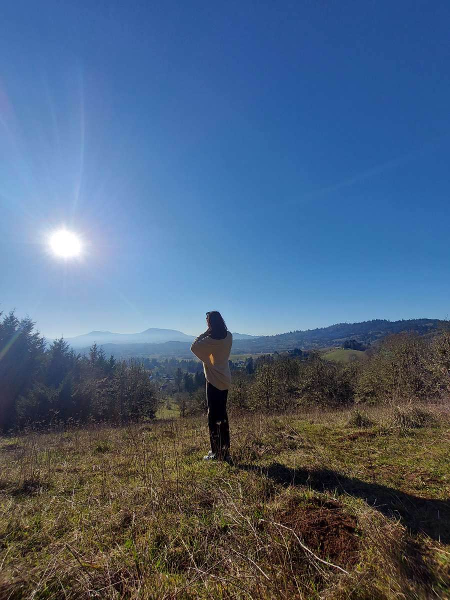
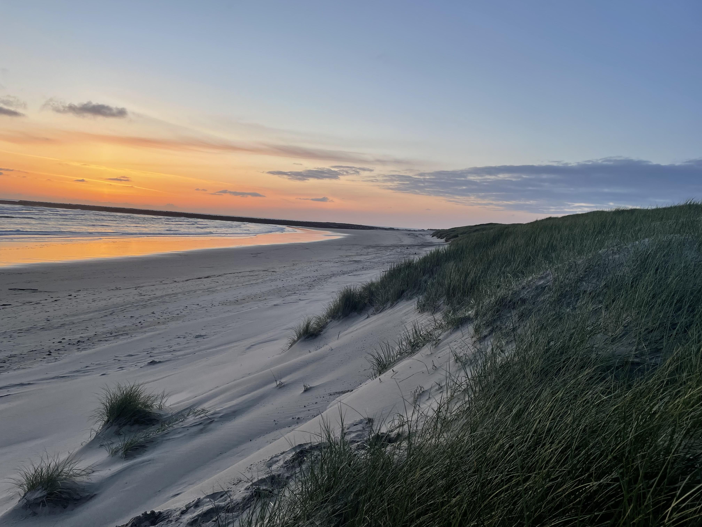
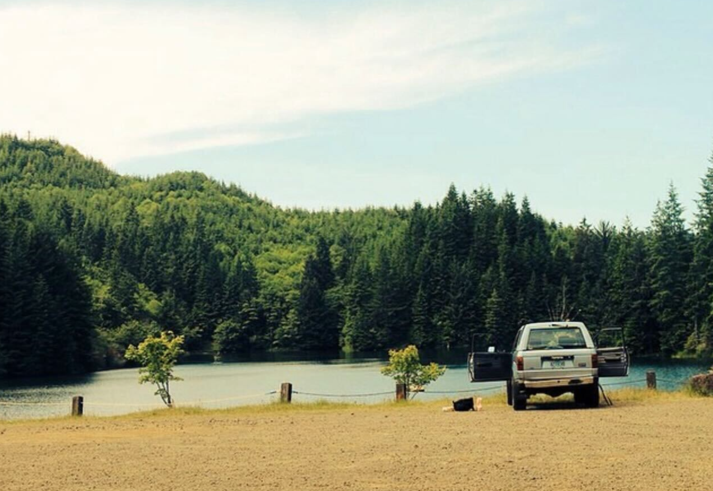
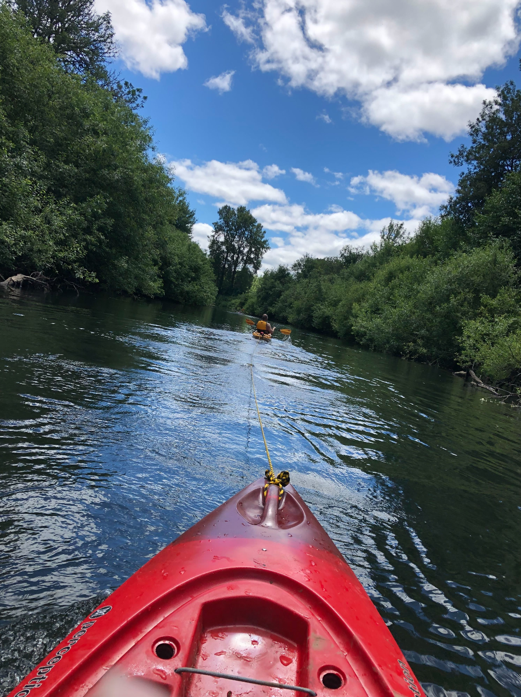
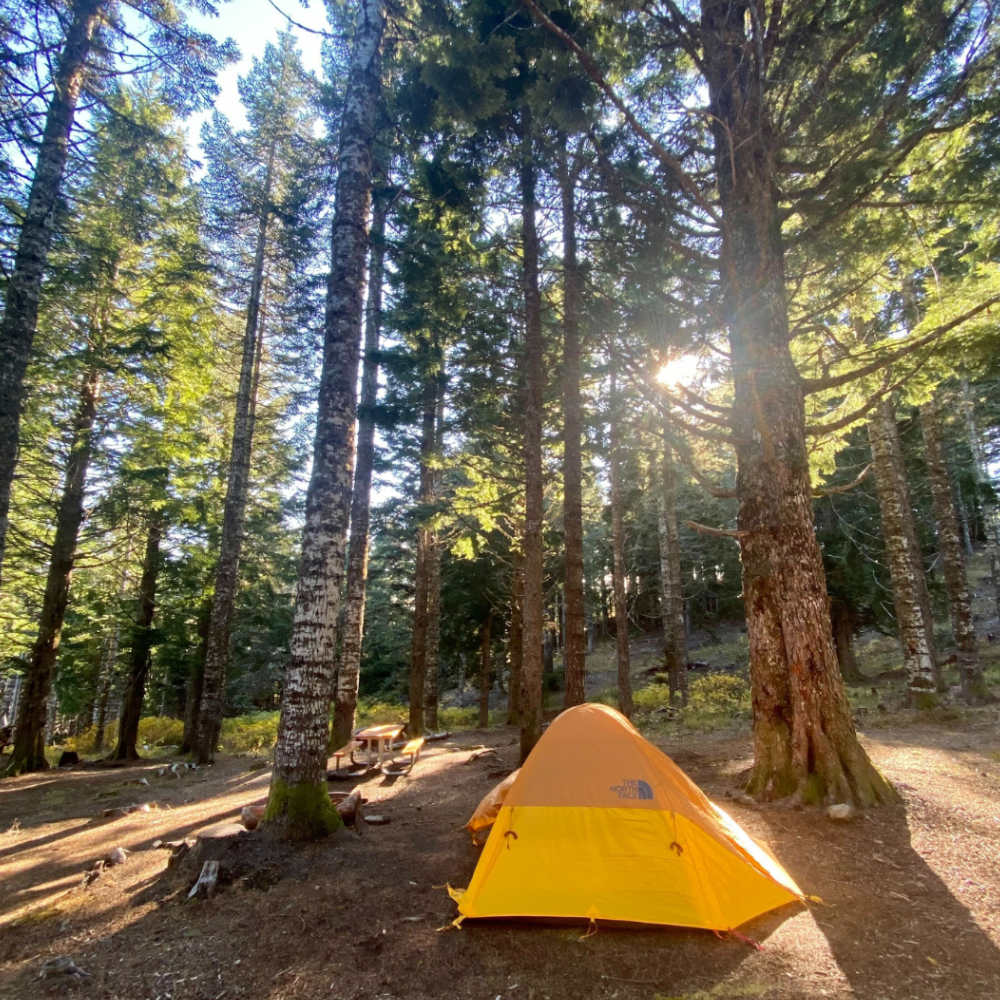

```{r setup, include=FALSE}
knitr::opts_chunk$set(echo = FALSE)
```

## About Corvallis

Located in the heart of the Willamette Valley, Corvallis is conveniently situated in relation to a variety of locations: 90 minutes to Portland for big city people, 45 minutes to the coast for ocean lovers, and surrounded by hiking, backpacking and skiing opportunities. Corvallis is home to roughly 60,000 people -- having a small town feel with some perks of a big city.

With much opportunity to explore and engage in many diverse communities, Corvallis is a welcoming and innovative community, with much to do outside of the university setting. Whether it be enjoying the local breweries or wineries, attending artistic gatherings or joining a pick-up sports league, Corvallis provides opportunities for all individuals.

To learn more about Corvallis, visit <https://www.visitcorvallis.com/> and <https://www.corvallisoregon.gov/community/page/about-corvallis>.

## BEAVERS Lab in Oregon

We have included some photos of our lab members exploring Corvallis and neighboring areas in Oregon.

:::float-image
```{r out.width = "75px", fig.cap= "Our PI, Dr. Bradford, his partner, and Caesar No Drama llama at a tulip farm outside of Portland.", echo=FALSE}
knitr::include_graphics("images/Daniel_1.png")
```
:::


:::float-image
```{r out.width = "75px", out.extra='style="float:above; padding:1px"', fig.cap= "Our lab manager, Angelica, skiing for the first time.", echo=FALSE}
knitr::include_graphics("images/Angelica_1.jpg")
```
:::

:::float-image
```{r out.width='75px', out.extra='style="float:above; padding:1px"', fig.cap= "Our lab manager, Angelica, at the peak of Smith Rock in Bend, OR.", echo=FALSE}
knitr::include_graphics("images/Angelica_2.jpg")
```
:::

:::float-image
```{r out.width='75px', out.extra='style="float:above; padding:1px"', fig.cap= "Our lab manager, Angelica, at Multnomah Falls, a 600ft waterfall outside of Portland.", echo=FALSE}
knitr::include_graphics("images/Angelica_4.jpg")
```
:::

:::float-image
```{r out.width='75px', out.extra='style="float:above; padding:1px"', fig.cap= "One of our Assistant Researchers, Mia, at the peak of Bald Hill in Corvallis.", echo=FALSE}

```
:::


:::float-image
```{r out.width='75px', out.extra='style="float:above; padding:1px"', fig.cap= "The view from Newport Beach.", echo=FALSE}

```
:::

:::float-image
```{r out.width='75px', out.extra='style="float:above; padding:1px"', fig.cap= "The view at Foster Lake.", echo=FALSE}

```
:::

:::float-image
```{r out.width='75px', out.extra='style="float:above; padding:1px"', fig.cap= "One of our Assistant Researchers, Lindsay, enjoying the view on the Willamette River in Corvallis.", echo=FALSE}

```
:::

:::float-image
```{r out.width='75px', out.extra='style="float:above; padding:1px"', fig.cap= "One of our Assistant Researchers, Jackson's, camping set up at Mary's Peak.", echo=FALSE}

```
:::