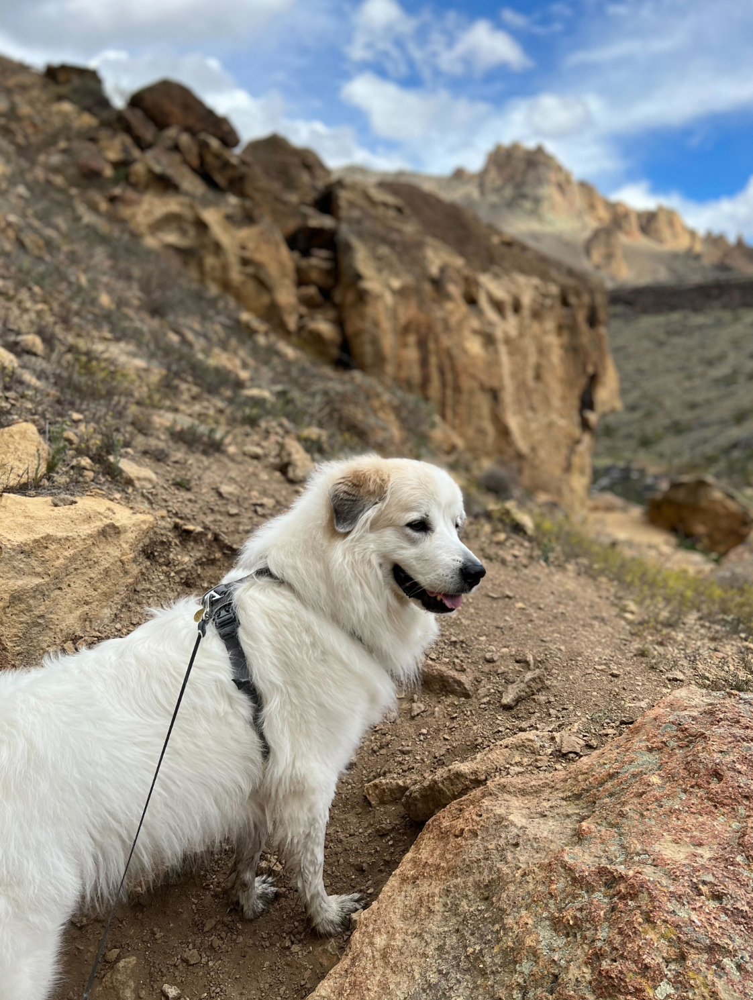
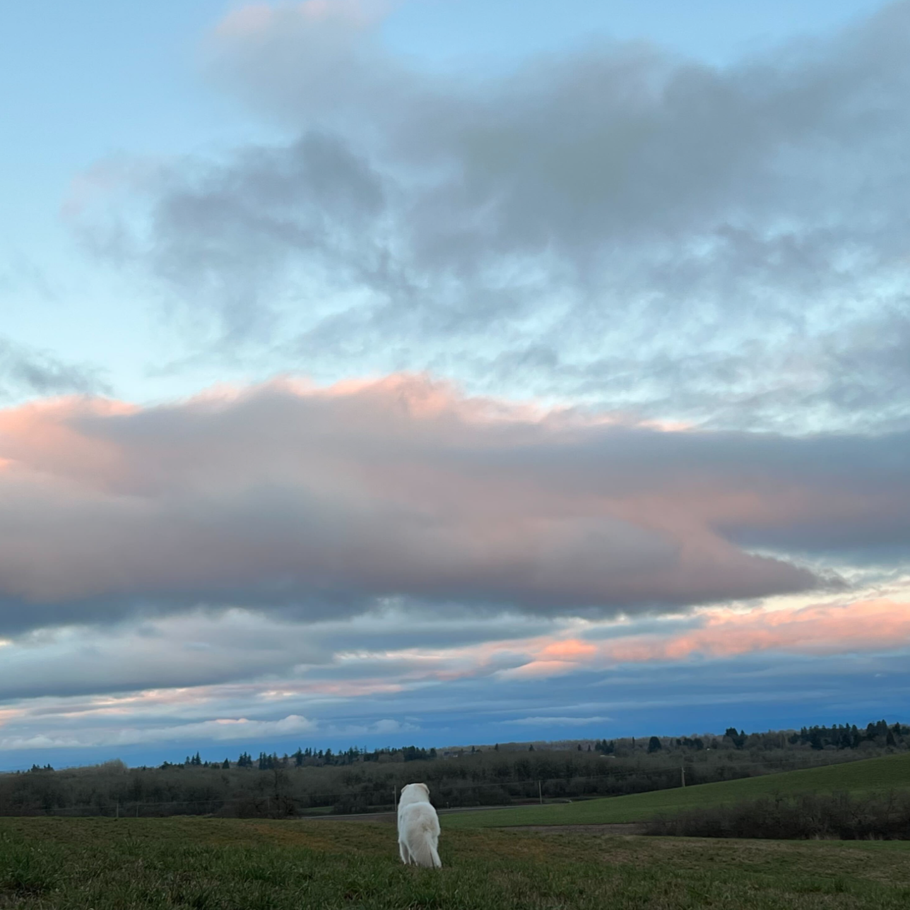
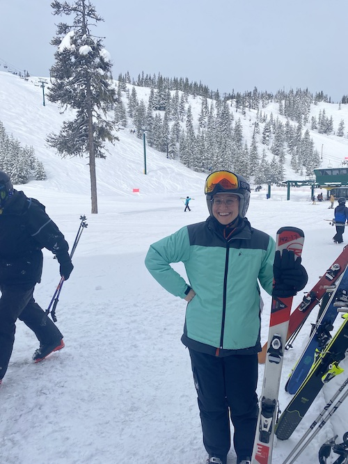
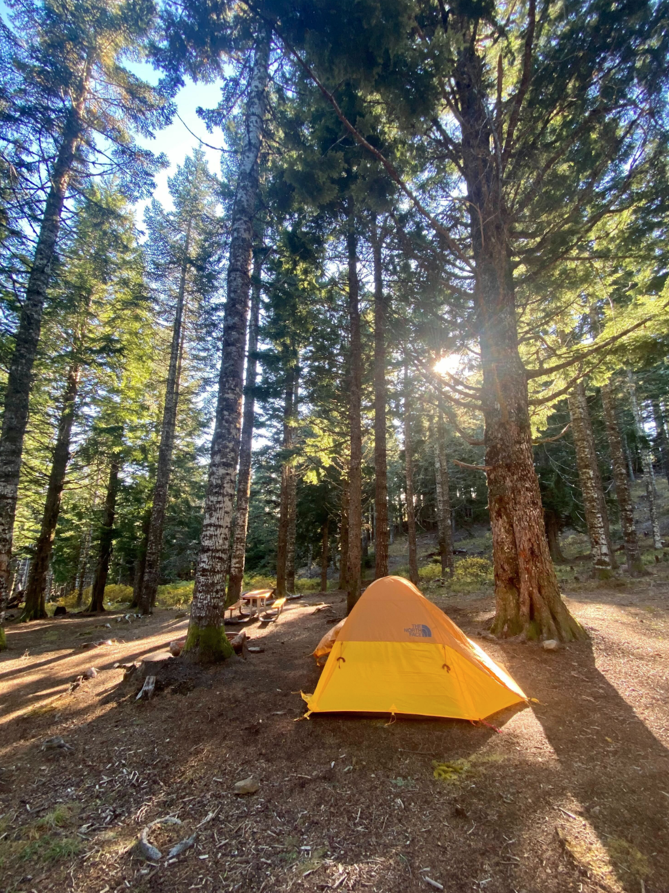

```{r setup, include=FALSE}
knitr::opts_chunk$set(echo = FALSE)
```

## About Corvallis

Located in the heart of the Willamette Valley, Corvallis is conveniently situated in relation to a variety of locations: 90 minutes to Portland for big city people, 45 minutes to the coast for ocean lovers, and surrounded by hiking, backpacking and skiing opportunities. Corvallis is home to roughly 60,000 people -- having a small town feel with some perks of a big city.

With much opportunity to explore and engage in many diverse communities, Corvallis is a welcoming and innovative community, with much to do outside of the university setting. Whether it be enjoying the local breweries or wineries, attending artistic gatherings or joining a pick-up sports league, Corvallis provides opportunities for all individuals.

To learn more about Corvallis, visit <https://www.visitcorvallis.com/> and <https://www.corvallisoregon.gov/community/page/about-corvallis>.

## BEAVERS Lab in Oregon

We have included some photos of our lab members exploring Corvallis and neighboring areas in Oregon.

:::float-image
```{r out.width = "75px", fig.cap= "Our PI, Dr. Bradford, his partner, and Caesar No Drama llama at a tulip farm outside of Portland.", fig.alt= "Two smiling people, one in a blue sweater and jeans, brown hair and one in a pink sweater and jeans, blonde hair with a llama in a field full of pink and yellow Tulip flowers.", echo=FALSE}
knitr::include_graphics("images/Daniel_1.png")
```
:::

:::float-image
```{r out.width='75px', out.extra='style="float:above; padding:1px"', fig.cap= "One of our lab pets, Lucy, enjoying a hike in Bend, OR.", fig.alt= "A white Great Pyrenees dog with their tongue out standing on a rock precipice.", echo=FALSE}

```
:::

:::float-image
```{r out.width='75px', out.extra='style="float:above; padding:1px"', fig.cap= "One of our lab pets, Lucy, enjoying a sunset view in Corvallis.", fig.alt= "A white Great Pyrenees dog in a field with trees and colorful clouds in the sky.", echo=FALSE}

```
:::

:::float-image
```{r out.width = "75px", out.extra='style="float:above; padding:1px"', fig.cap= "Our lab manager, Angelica, skiing for the first time.", fig.alt= "A smiling person in a blue coat, helmet, holding skiis at a snowy mountain.", echo=FALSE}

```
:::

:::float-image
```{r out.width='75px', out.extra='style="float:above; padding:1px"', fig.cap= "Our lab manager, Angelica, at the peak of Smith Rock in Bend, OR.", fig.alt= "A smiling person holding up a peace sign wearing a red sweater at the top of a rocky hike.", echo=FALSE}

```
:::

:::float-image
```{r out.width='75px', out.extra='style="float:above; padding:1px"', fig.cap= "Our lab manager, Angelica, at Multnomah Falls, a 600ft waterfall outside of Portland.", fig.alt = "A smiling person selfie with their arm out in a black coat and hat with a large waterfall and bridge in the background.", echo=FALSE}
knitr::include_graphics("images/Angelica_4.jpg")
```
:::

:::float-image
```{r out.width='75px', out.extra='style="float:above; padding:1px"', fig.cap= "One of our Assistant Researchers, Mia, at the peak of Bald Hill in Corvallis.", fig.alt= "A person facing the horizon wearing a beige sweater and a clear, sunny sky above.", echo=FALSE}

```
:::


:::float-image
```{r out.width='75px', out.extra='style="float:above; padding:1px"', fig.cap= "The view from Newport Beach.", fig.alt= "A picture of a beach and dunes with bright orange and pink sunset in the sky reflectin off the ocean.", echo=FALSE}

```
:::

:::float-image
```{r out.width='75px', out.extra='style="float:above; padding:1px"', fig.cap= "The view at Foster Lake.", fig.alt= "A picture of a lake with trees in the background, sand in the foreground and a Jeep with doors open on the right.", echo=FALSE}

```
:::

:::float-image
```{r out.width='75px', out.extra='style="float:above; padding:1px"', fig.cap= "One of our Assistant Researchers, Lindsay, enjoying the view on the Willamette River in Corvallis.", fig.alt= "A picture from the inside of a red kayak on a river lined with trees with another person and kayak in the distance ahead. The kayaks are connected with a rope and the sky has some fluffy clouds.", echo=FALSE}

```
:::

:::float-image
```{r out.width='75px', out.extra='style="float:above; padding:1px"', fig.cap= "One of our Assistant Researchers, Jackson's, camping set up at Mary's Peak.", fig.alt= "A picture of a yellow tent surrounded by tall trees with sun peeking through the branches.", echo=FALSE}

```
:::