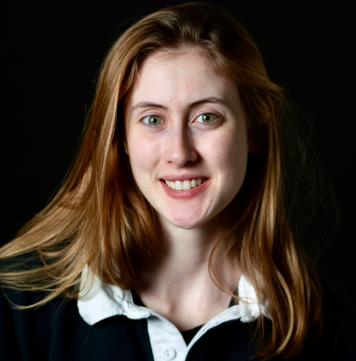

<center>
## Lab Members
</center>

<br/>

:::float-image

```{r out.width='150px', out.extra='style="float:above; padding:1px"', echo=FALSE}
knitr::include_graphics("images/Daniel.JPG")
```

[Daniel Bradford, Ph.D](DanielB.html) 
<br/>
**Assistant Professor and Lab Director**
<br/>
[CV](files/CVs/Bradford_CV.pdf) [Google Scholar](https://scholar.google.com/citations?user=mFzYd1sAAAAJ&hl=en) [Twitter](https://twitter.com/drdanbradford)
:::

<br/>

:::float-image

```{r out.width='150px', out.extra='style="float:above; padding:1px"', echo=FALSE}
knitr::include_graphics("images/AngelicaD.jpg")
```

[Angelica DeFalco, B.S.](AngelicaD.html) 
<br/>
**Lab Manager**
<br/>
[CV](files/CVs/DeFalco_CV.pdf) [Twitter](https://twitter.com/A_DeFalco11)
:::

<br/>

:::float-image

```{r out.width='150px', out.extra='style="float:above; padding:1px"', echo=FALSE}
knitr::include_graphics("images/LindsayB.png")
```
[Lindsay Beaman](LindsayB.html)
<br/>
**Research Assistant**
:::

<br/>

:::float-image

```{r out.width='150px', out.extra='style="float:above; padding:1px"', echo=FALSE}
knitr::include_graphics("images/JacksonC.png")
```

[Jackson Cutler](JacksonC.html)
<br/>
**Research Assistant**
:::

<br/>

:::float-image

```{r out.width='150px', out.extra='style="float:above; padding:1px"', echo=FALSE}
knitr::include_graphics("images/NicoD.png")
```

[Nico Doran](NicoD.html)
<br/>
**Research Assistant**
:::

<br/>

:::float-image

```{r out.width='150px', out.extra='style="float:above; padding:1px"', echo=FALSE}
knitr::include_graphics("images/MiaT.png")
```
[Mia Tognoli](MiaT.html)
<br/>
**URSA Engage Research Assistant**
:::

<center> 
## Graduate Students
</center>
:::float-image

```{r out.width='150px', out.extra='style="float:above; padding:1px"', echo=FALSE}

```

[Freya Whittaker](FreyaW.html) 
<br/>
**Graduate Student, Health Psychology**
<br/>
[CV](files/CVs/Whittaker_CV.pdf) [Twitter](https://twitter.com/fmwhittaker)
:::

<center> 
## Collaborators
</center>

<br/>

:::float-image

```{r out.width='150px', out.extra='style="float:above; padding:1px"', echo=FALSE}
knitr::include_graphics("images/CourtneyB.png")
```

[Courtney Beard, Ph.D](CourtneyB.html) 
<br/>
**Director of CARE lab, McLean Hospital/Harvard Medical School**
:::

<br/>

:::float-image

```{r out.width='150px', out.extra='style="float:above; padding:1px"', echo=FALSE}
knitr::include_graphics("images/JessieO.png")
```

[Jessie Oldham, Ph.D](JessieO.html) 
<br/>
**Assistant Professor, Department of Physical Medicine and Rehabilitation at Virginia Commonwealth University**
:::

<br/>

:::float-image

```{r out.width='150px', out.extra='style="float:above; padding:1px"', echo=FALSE}
knitr::include_graphics("images/FeliciaJ.png")
```

[Felicia Jackson, Ph.D](FeliciaJ.html) 
<br/>
**Licensed Clinical Psychologist at Jackson Psych**
:::

<br/>

:::float-image

```{r out.width='150px', out.extra='style="float:above; padding:1px"', echo=FALSE}
knitr::include_graphics("images/FallonG.png")
```

[Fallon Goodman, Ph.D](FallonG.html) 
<br/>
**Assistant Professor and Director of Goodman Emotion and Resilience Laboratory at the University of South Florida (USF)**
:::
```{r setup, include=FALSE}
knitr::opts_chunk$set(echo = FALSE)
```