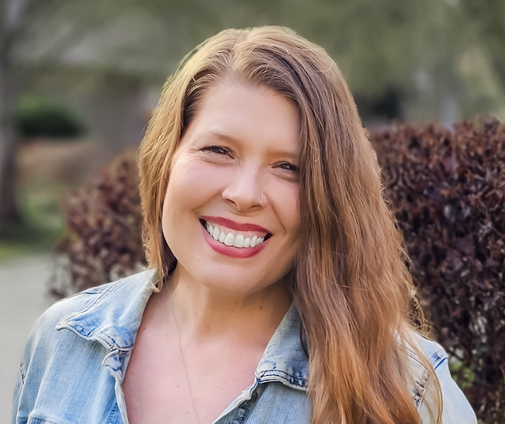
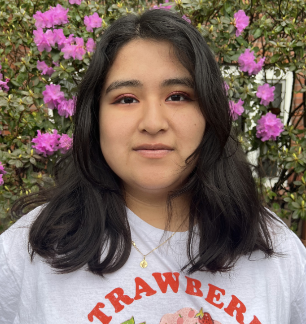

<center>
## Faculty
</center>

<br/>

:::float-image

```{r, out.width="150px", out.extra='style="float:above; padding:1px"', echo=FALSE, fig.alt= "Picture of a person with short brown hair, brown facial hair, black rectangular glasses, fair skin and a smile with a brick building in the background."}
knitr::include_graphics("images/Daniel.JPG")
```

[Daniel Bradford, Ph.D](DanielB.html) 
<br/>
**Assistant Professor and Lab Director**
<br/>
[CV](files/CVs/Bradford_CV.pdf) [Google Scholar](https://scholar.google.com/citations?user=mFzYd1sAAAAJ&hl=en) [Twitter](https://twitter.com/drdanbradford)
:::


<br/>

<center> 
## Graduate Students
</center>
:::float-image

```{r, out.width='150px', out.extra='style="float:above; padding:1px"', fig.alt = "Picture of a smiling person with shoulder length blonde straight hair, fair skin and a black sleeveless shirt with a background of greenery.", echo=FALSE}

```

[Freya Whittaker](FreyaW.html) 
<br/>
**Graduate Student, Health Psychology**
<br/>
[CV](files/CVs/Whittaker_CV.pdf) [Google Scholar](https://scholar.google.com/citations?hl=en&user=6EXE-RUAAAAJ) [Twitter](https://twitter.com/fmwhittaker)
:::
<br/>

<center> 
## Assistant Researchers
</center>


:::float-image

```{r, out.width='150px', out.extra='style="float:above; padding:1px"', fig.alt = "Picture of a smiling person with long strawberry blonde straight hair, fair skin, a black shirt and blue jeans against a pink background.",echo=FALSE}
knitr::include_graphics("images/LindsayB.png")
```
[Lindsay Beaman](LindsayB.html)
<br/>
**Undergraduate Assistant Researcher**
:::


<br/>

:::float-image

```{r, out.width='150px', out.extra='style="float:above; padding:1px"', fig.alt = "Selfie of a person with medium length curly hair, fair skin, and a black rain jacket against a background full of trees.", echo=FALSE}
knitr::include_graphics("images/NicoD.png")
```

[Nico Doran](NicoD.html)
<br/>
**Undergraduate Assistant Researcher**
:::

<br/>

:::float-image

```{r, out.width='150px', out.extra='style="float:above; padding:1px"', fig.alt = "Selfie of a person with medium length curly hair, fair skin, and a black rain jacket against a background full of trees.", echo=FALSE}

```

[Corryn Dooley](CorrynD.html)
<br/>
**Undergraduate Assistant Researcher**
:::

<br/>

:::float-image

```{r, out.width='150px', out.extra='style="float:above; padding:1px"', fig.alt = "Selfie of a person with medium length curly hair, fair skin, and a black rain jacket against a background full of trees.", echo=FALSE}

```

[Emma Gilmore](EmmaG.html)
<br/>
**Honors Thesis Assistant Researcher**
:::

<br/>

:::float-image

```{r, out.width='150px', out.extra='style="float:above; padding:1px"', fig.alt = "Picture of a smiling person with long brown hair and a polo shirt on.",echo=FALSE}

```
[Nick Peavey](NickP.html)
<br/>
**Volunteer Assistant Researcher**
:::

<br/>

:::float-image

```{r, out.width='150px', out.extra='style="float:above; padding:1px"', fig.alt = "Picture of a smiling person with long strawberry blonde straight hair, fair skin, a black shirt and blue jeans against a pink background.",echo=FALSE}
# ### 
```
[Susie Respini](SusieR.html)
<br/>
**Volunteer Assistant Researcher**
:::

<br/>

:::float-image

```{r, out.width='150px', out.extra='style="float:above; padding:1px"', fig.alt = "Picture of a smiling person with long dark hair, fair skin, a black shirt and blue jeans against a pink background.",echo=FALSE}

```
[EJ Rifkin](EJR.html)
<br/>
**Volunteer Assistant Researcher**
:::

<br/>

:::float-image

```{r, out.width='150px', out.extra='style="float:above; padding:1px"', fig.alt = "Photo of a person with blond curly hair wearing a brown cowboy hat against a backdrop of greenery.", echo=FALSE}

```

[Catalina Slangan](CatalinaS.html)
<br/>
**Undergraduate Assistant Researcher**
:::

<br/>

:::float-image

```{r, out.width='150px', out.extra='style="float:above; padding:1px"', fig.alt = "Selfie of a person with medium length curly hair, fair skin, and a black rain jacket against a background full of trees.", echo=FALSE}

```

[Lucas Tepe](LucasT.html)
<br/>
**Undergraduate Assistant Researcher**
:::

<br/>

:::float-image

```{r, out.width='150px', out.extra='style="float:above; padding:1px"', fig.alt="Picture of a smiling person with long dark straight hair and two streaks of pink hair, fair skin, and a black shirt against a leafy background.", echo=FALSE}

```
[Mia Tognoli](MiaT.html)
<br/>
**Honors Thesis Assistant Researcher**
:::

<br/>

:::float-image

```{r, out.width='150px', out.extra='style="float:above; padding:1px"', fig.alt="Picture of a smiling person with curly hair with fair, freckled skin, against a neutral-colored wall.", echo=FALSE}

```
[Genna Watkins](GennaW.html)
<br/>
**Undergraduate Assistant Researcher**
:::

<center> 
## Collaborators
</center>

<br/>

:::float-image

```{r, out.width='150px', out.extra='style="float:above; padding:1px"', fig.alt = "Picture of a smiling person with long blonde hair, fair skin, and a mint green shirt against a grey background.", echo=FALSE}
knitr::include_graphics("images/JessieO.png")
```

[Jessie Oldham, Ph.D](JessieO.html) 
<br/>
**Assistant Professor, Department of Physical Medicine and Rehabilitation at Virginia Commonwealth University**
:::

<br/>

:::float-image

```{r, out.width='150px', out.extra='style="float:above; padding:1px"', fig.alt = "Picture of a smiling person with long brown hair, black circular glasses, fair skin and a blue polka-dotted shirt against a brick background.", echo=FALSE}
knitr::include_graphics("images/FallonG.png")
```

[Fallon Goodman, Ph.D](FallonG.html) 
<br/>
**Assistant Professor and Director of Emotion and Resilience Laboratory at George Washington University**
:::
```{r setup, include=FALSE}
knitr::opts_chunk$set(echo = FALSE)
```

<br/>

:::float-image

```{r, out.width='150px', out.extra='style="float:above; padding:1px"', fig.alt = "Picture of a smiling person with a long curly afro, dark skin, and a floral printed shirt against a green background.", echo=FALSE}
knitr::include_graphics("images/FeliciaJ.png")
```

[Felicia Jackson, Ph.D](FeliciaJ.html) 
<br/>
**Licensed Clinical Psychologist at Jackson Psych**
:::

<br/>

:::float-image

```{r, out.width='150px', out.extra='style="float:above; padding:1px"', fig.alt= "Picture of a smiling person with a bob dark haircut, fair skin and a red turtleneck shirt against a blurred out background.", echo=FALSE}
knitr::include_graphics("images/CourtneyB.png")
```

[Courtney Beard, Ph.D](CourtneyB.html) 
<br/>
**Director of CARE lab, McLean Hospital/Harvard Medical School**

:::

<br/>

<center> 
## Lab Alumni
</center>
:::float-image

```{r, out.width='150px', out.extra='style="float:above; padding:1px"', fig.alt = "Picture of a smiling person with long brown curled hair, fair skin, and a white sash around their neck and a green dress with a blue sky, lake and buildings in the background.", echo=FALSE}
knitr::include_graphics("images/AngelicaD.jpg")
```

[Angelica DeFalco, B.S.](AngelicaD.html) 
<br/>
**2021-2023 Lab Manager** <br/>
**Graduate Student in Counseling Psychology, Colorado State University**
<br/>
[Google Scholar](https://scholar.google.com/citations?user=lXu-bq4AAAAJ&hl=en&oi=ao) [Twitter](https://twitter.com/A_DeFalco11)
:::

<br/>

:::float-image

```{r, out.width='150px', out.extra='style="float:above; padding:1px"', fig.alt = "Picture of a smiling person with short black hair, and a Strawberry Shortcake white shirt on.",echo=FALSE}

```
[Karen Agustin-Paz](KarenAP.html)
<br/>
**STEM Leaders Assistant Researcher, 2022-2023**
:::

<br/>

:::float-image

```{r, out.width='150px', out.extra='style="float:above; padding:1px"', fig.alt = "Picture of a smiling person with a black hat on, fair skin, and a grey rain jacket against a mountaneous background.", echo=FALSE}
knitr::include_graphics("images/JacksonC.png")
```

[Jackson Cutler](JacksonC.html)
<br/>
**Undergraduate Assistant Researcher, 2021-2022**
:::

<br/>

:::float-image

```{r, out.width='150px', out.extra='style="float:above; padding:1px"', fig.alt = "Image of a person with straight brown hair and fair skin with freckles wearing a striped shirt leaning against a tree trunk.", echo=FALSE}

```

[Dakota Smith](DakotaS.html)
<br/>
**Undergraduate Assistant Researcher, 2022-2023**
:::