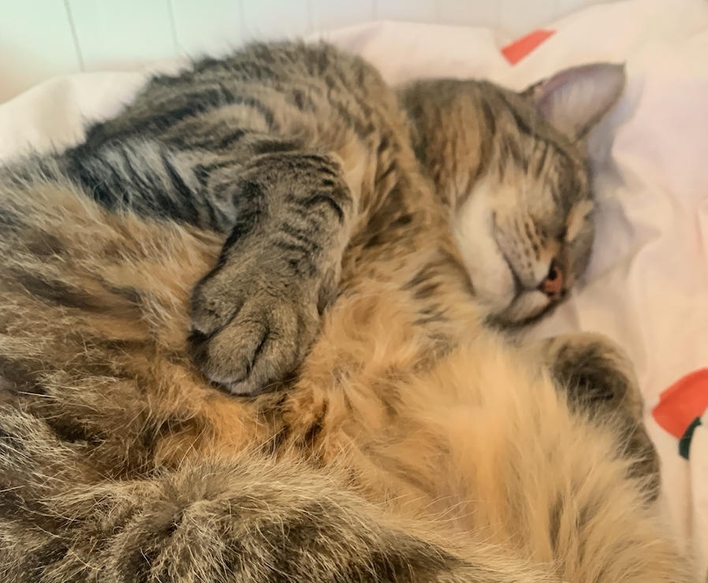
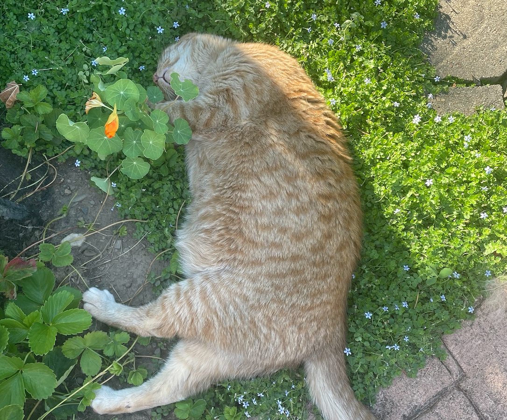
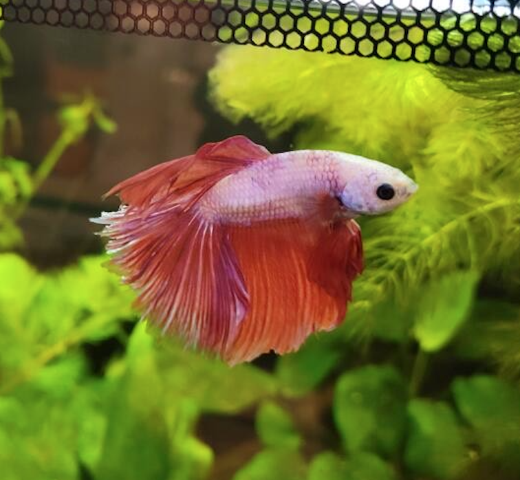

:::float-image

```{r, out.width='150px', out.extra='style="float:above; padding:1px"', fig.alt= "Picture of a large white dog's face, chewing on a bone, looking at the camera against a white wall background.", echo=FALSE}
knitr::include_graphics("images/LucyB.png")
```

[Lucy Bradford](LucyB.html) 
<br/>
**Great Pyrenees Mountain Dog**
:::

<br/>
<br/>

:::float-image

```{r, out.width='150px', out.extra='style="float:above; padding:1px"', fig.alt = "Picture of a black, white and orange cat on the ground looking up at the camera and a rat toy in front of them.", echo=FALSE}
knitr::include_graphics("images/MomoD.png")
```

[Momo DeFalco](MomoD.html) 
<br/>
**Calico Cat**
:::

:::float-image

```{r, out.width='150px', out.extra='style="float:above; padding:1px"', fig.alt= "A drawing of a smiling beaver with an orange EEG cap on and two electrodes placed under its right eye.", echo=FALSE}
knitr::include_graphics("images/Dr_BennitoNoBG.png")
```

[Dr. Bennito](Dr_Bennito.html) 
<br/>
**Beaver**
:::

:::float-image

```{r, out.width='150px', out.extra='style="float:above; padding:1px"', fig.alt= "Picture of two cats laying side by side. The cat on the left is black and white spotted, laying on its back with its paws stretched out and its eyes closed. The cat on the right is black with bright green/yellow eyes, laying on its stomach with its paws around the other cat.They are laying on a sofa with a red blanket on it.", echo=FALSE}
knitr::include_graphics("images/MoandSid.png")
```

[Mo and Sid Beaman](MoandSid.html) 
<br/>
**Cats**
:::

:::float-image

```{r, out.width='150px', out.extra='style="float:above; padding:1px"', fig.alt = "Picture of a grey and black striped cat laying down on its side, with its paws on its belly. The cat is sleeping with its eyes closed and belly up.", echo=FALSE}

```

[Katty Tognoli](KattyT.html) 
<br/>
**Black Tabby Cat**
:::

:::float-image

```{r, out.width='150px', out.extra='style="float:above; padding:1px"', fig.alt = "Picture of an orange cat laying on its side, sleeping with its head upside down, outside in the grass and flowers.", echo=FALSE}

```

[Oliver Tognoli](OliverT.html) 
<br/>
**Orange Tabby Cat**
:::

:::float-image

```{r, out.width='150px', out.extra='style="float:above; padding:1px"', fig.alt = "Picture of a Betta fish with pinkish red fins in a tank against a leafy background.", echo=FALSE}

```

[Buddy Tognoli](BuddyT.html) 
<br/>
**Betta Fish**
:::