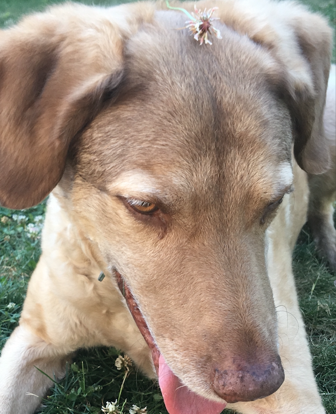

:::float-image

```{r out.width='150px', out.extra='style="float:above; padding:1px"', echo=FALSE}
knitr::include_graphics("images/LucyB.png")
```

[Lucy Bradford](LucyB.html) 
<br/>
**Great Pyrenees Moutain Dog**
:::

<br/>
<br/>

:::float-image

```{r out.width='150px', out.extra='style="float:above; padding:1px"', echo=FALSE}
knitr::include_graphics("images/MomoD.png")
```

[Momo DeFalco](MomoD.html) 
<br/>
**Calico Cat**
:::

:::float-image

```{r out.width='150px', out.extra='style="float:above; padding:1px"', echo=FALSE}
knitr::include_graphics("images/Dr_BennitoNoBG.png")
```

[Dr. Bennito](Dr_Bennito.html) 
<br/>
**Beaver**
:::

:::float-image

```{r out.width='150px', out.extra='style="float:above; padding:1px"', echo=FALSE}
knitr::include_graphics("images/MoandSid.png")
```

[Mo and Sid Beaman](MoandSid.html) 
<br/>
**Cats**
:::

:::float-image

```{r out.width='150px', out.extra='style="float:above; padding:1px"', echo=FALSE}

```

[Katty Tognoli](KattyT.html) 
<br/>
**Black Tabby Cat**
:::

:::float-image

```{r out.width='150px', out.extra='style="float:above; padding:1px"', echo=FALSE}
knitr::include_graphics("images/OliverT.png")
```

[Oliver Tognoli](OliverT.html) 
<br/>
**Orange Tabby Cat**
:::

:::float-image

```{r out.width='150px', out.extra='style="float:above; padding:1px"', echo=FALSE}

```

[Mobius (Mo) Tognoli](MobiusT.html) 
<br/>
**Chesapeake Bay Retriever**
:::

:::float-image

```{r out.width='150px', out.extra='style="float:above; padding:1px"', echo=FALSE}
knitr::include_graphics("images/BuddyT.png")
```

[Buddy Tognoli](BuddyT.html) 
<br/>
**Beta Fish**
:::