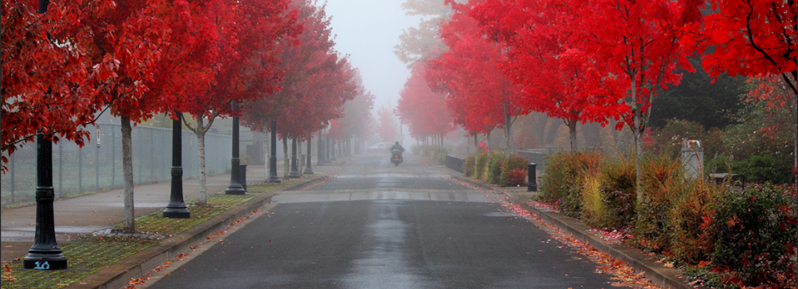
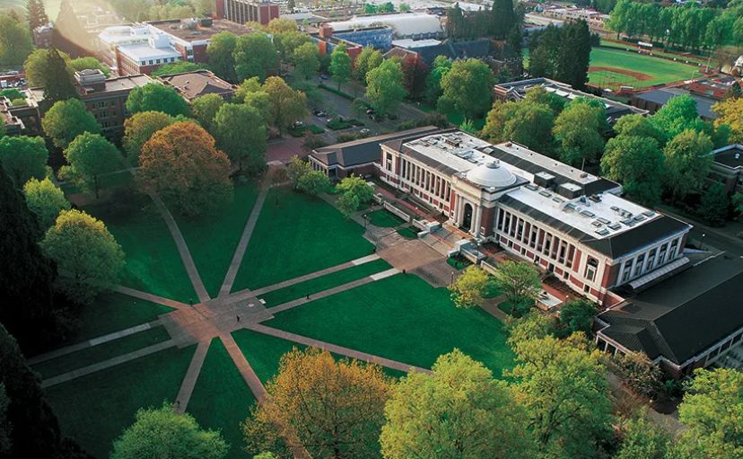

<!-- <div class="banner"> -->
<!--    -->
<!--    -->
<!-- </div> -->

<!-- <style> -->
<!-- .banner { -->
<!--   position: relative; -->
<!--   width: 100%; -->
<!--   height: 400px; -->
<!--   overflow: hidden; -->
<!--   margin-bottom: 20px; -->
<!-- } -->

<!-- .banner-image { -->
<!--   position: absolute -->
<!--   width: 100%; -->
<!--   height: 100%; -->
<!--   object-fit: cover; -->
<!--   animation: bannerFade 10s infinite; -->
<!-- } -->

<!-- .banner-1 {  -->
<!--   opacity: 0; -->
<!--   animation-delay: 0s; -->
<!-- } -->

<!-- .banner-2 { -->
<!--   opacity: 1; -->
<!--   animation-delay: 5s; -->
<!-- } -->

<!-- @keyframes bannerFade { -->
<!--   0%, 50% { -->
<!--     opacity: 1; -->
<!--   } -->
<!--   50.1%, 100% { -->
<!--     opacity: 0; -->
<!--   } -->
<!-- } -->
<!-- </style> -->

<!-- --- -->


:::float-image

```{r fig.alt ="A drawing of a smiling beaver with an orange EEG cap on and two electrodes placed under its right eye.", out.width='175px', out.extra='style="float:left; padding:3px"', echo=FALSE}
knitr::include_graphics("images/Dr_BennitoNoBG.png")
```

NOTE: This website is currently under construction so some pages are a bit out of date. We are a psychophysiological research lab in the [School of Psychological Science](https://catalog.oregonstate.edu/college-departments/liberal-arts/school-psychological-sciences/) at [Oregon State University](https://oregonstate.edu/). We take a multi-method experimental approach to studying the affective and emotional responses to stressors and how commonly used drugs and brain injury (i.e., TBI/concussions) change those responses. We study the mechanisms of these responses by assessing their neurobiological, cognitive, and behavioral components. We want to learn how responses to stressors play a role in mental health challenges such as addiction and anxiety so, eventually, we can better treat such challenges. Because we want to get to the truth in our research, we approach our work with an eye to rigor, equity, and replicability all consistent with the “reproducibility revolution” and open science movement.
:::

<div class="note">
<strong> NOTE:</strong> Dr. Bradford **WILL** be reviewing applications for the 2025-2026 graduate student application cycle for the Psychology PhD program with focus on Health Psychology and for the new Clinical Science option. Our Clinical Science option is new as of last year and we are currently seeking APA accreditation. If you would like to learn more about the Clinical Science option, please click [here](https://catalog.oregonstate.edu/college-departments/liberal-arts/school-psychological-sciences/psychology-ms-phd/clinical-science-option/). You can find an FAQ that our lab thinks could be helpful with your application process [here](https://docs.google.com/document/d/1cgiioIpdXRSe2QdZZRGtCqdK9Jglsd_KBV58uBdfjhw/edit).
Feel free to contact Dr. Bradford at daniel.bradford@oregonstate.edu with any questions. </div> 

<!--- Dr. Bradford will be reviewing applications for the 2023 graduate student application cycle for the Health Psychology PhD program. If you would like to learn more about the Health Psychology PhD program at OSU, click [here](https://liberalarts.oregonstate.edu/sps/psychology/graduate-psychology/about-our-program/health-psychology-area). Feel free to contact Dr. Bradford at daniel.bradford@oregonstate.edu with any questions.--> 
<!---->

<!-- if doing in R: ```{r, layout="l-screen-inset", fig.cap="Atlantic Forest landscape in southern Brazil", echo=FALSE}
knitr::include_graphics("img/img2.jpg")
```-->

<!-- -->

```{r setup, include=FALSE}
knitr::opts_chunk$set(echo = FALSE)

# Learn more about creating websites with Distill at:
# https://rstudio.github.io/distill/website.html

```

